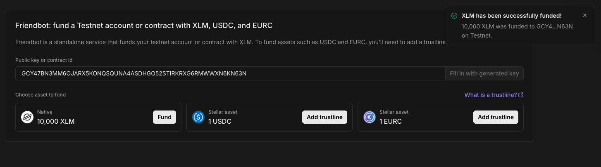
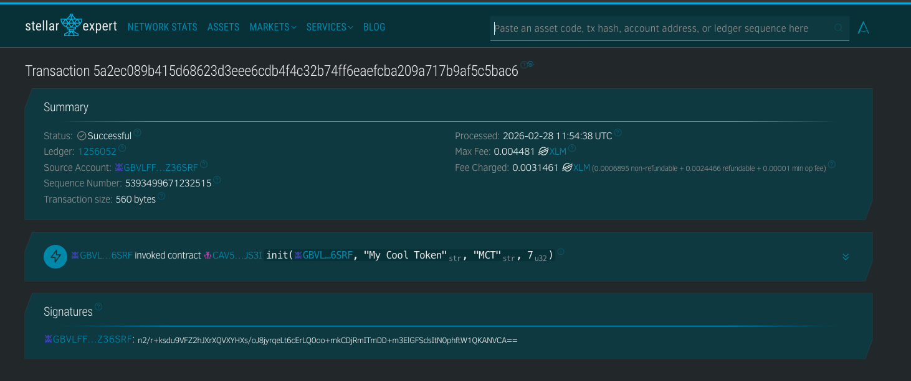

# Отчет

Состав вашей группы:
- Ягодин Захар
- Костыгов Андрей
- Мамченко Дмитрий

Ссылку на ваш верифицированный контракт в обозревателе сети:
- [link](https://lab.stellar.org/smart-contracts/contract-explorer?$=network$id=testnet&label=Testnet&horizonUrl=https:////horizon-testnet.stellar.org&rpcUrl=https:////soroban-testnet.stellar.org&passphrase=Test%20SDF%20Network%20/;%20September%202015;&smartContracts$explorer$contractId=CDNY6KYH64K4FSPUKIOXKGIEGKE7VRY6VEADEH4MNDYEQLTRM2AZVR5H;;)

В сети Stellar не используется ChainId в формате EVM.
Аналогом идентификации сети являются Network Passphrase и Network ID.

- Network Passphrase: Test SDF Network ; September 2015
- Network ID: cee0302d59844d32bdca915c8203dd44b33fbb7edc19051ea37abedf28ecd472

## Подготовка кошелька
Для начала работы вам необходимо установить кошелёк:

Я нашел https://rabet.io/, с ним и буду работать
На сайте была ссылка на Freighter, но он не доступен, хз почему

Переключите сеть на нужную тестовую сеть


Введите адрес своего кошелька и запросите средства.
Пополнил из этого крана [stellarLab](https://lab.stellar.org/account/fund?$=network$id=testnet&label=Testnet&horizonUrl=https:////horizon-testnet.stellar.org&rpcUrl=https:////soroban-testnet.stellar.org&passphrase=Test%20SDF%20Network%20/;%20September%202015;;)


## Подготовка среды разработки (Stellar / Soroban)
### Подготовим файлы
```sh 
touch .env
echo ".env" >> .gitignore
```

### Подготовим сеть
```sh
stellar --version
# stellar 25.1.0
# stellar-xdr 25.0.0 (dc9f40fcb83c3054341f70b65a2222073369b37b)
# xdr curr (0a621ec7811db000a60efae5b35f78dee3aa2533)

stellar network add \
  --rpc-url https://soroban-testnet.stellar.org \
  --network-passphrase "Test SDF Network ; September 2015" \
  testnet


stellar network ls --long

# Global "/Users/mityaiiii/.config/stellar/network/testnet.toml"
# Name: testnet
# Network {
#     rpc_url: "https://soroban-testnet.stellar.org",
#     rpc_headers: [],
#     network_passphrase: "Test SDF Network ; September 2015",
# }

# Default
# Name: local
# Network {
#     rpc_url: "http://localhost:8000/rpc",
#     rpc_headers: [],
#     network_passphrase: "Standalone Network ; February 2017",
# }

# Default
# Name: futurenet
# Network {
#     rpc_url: "https://rpc-futurenet.stellar.org:443",
#     rpc_headers: [],
#     network_passphrase: "Test SDF Future Network ; October 2022",
# }

# Default
# Name: mainnet
# Network {
#     rpc_url: "Bring Your Own: https://developers.stellar.org/docs/data/rpc/rpc-providers",
#     rpc_headers: [],
#     network_passphrase: "Public Global Stellar Network ; September 2015",
# }

# Default
# Name: testnet
# Network {
#     rpc_url: "https://soroban-testnet.stellar.org",
#     rpc_headers: [],
#     network_passphrase: "Test SDF Network ; September 2015",
# }

stellar network use testnet
# ℹ️  The default network is set to `testnet`
```

### Установил rust
```sh
curl --proto '=https' --tlsv1.2 -sSf https://sh.rustup.rs | sh

. "$HOME/.cargo/env"            # For sh/bash/zsh/ash/dash/pdksh
source "$HOME/.cargo/env.fish"  # For fish
source $"($nu.home-path)/.cargo/env.nu"  # For nushell

rustc --version
rustc 1.93.1 (01f6ddf75 2026-02-11)
rustup target add wasm32v1-none
```

### Создал шаблон Soroban
```
stellar contract init my-cool-token
cd my-cool-token
```

## Реализация
### Обязательные методы:
- totalSupply()
- balanceOf(address _owner)
- transfer(address _to, int128 _value)
- transferFrom(address _from, address _to, int128 _value)
- approve(address _spender, int128 _value)
- allowance(address _owner, address _spender)
### Обязательные события:
- Transfer
- Approval
### Код
```rust
#![no_std]

use soroban_sdk::{
    contract, contracterror, contractimpl, contracttype, panic_with_error, Address, Env, String,
};

#[contracterror]
#[derive(Copy, Clone, Debug, Eq, PartialEq)]
#[repr(u32)]
pub enum TokenError {
    AlreadyInitialized = 1,
    NotInitialized = 2,
    AmountMustBePositive = 3,
    InsufficientBalance = 4,
    InsufficientAllowance = 5,
    Overflow = 6,
}

#[contracttype]
#[derive(Clone)]
enum DataKey {
    Owner,
    Name,
    Symbol,
    Decimals,
    TotalSupply,
    Balance(Address),
    Allowance(AllowanceKey),
}

#[contracttype]
#[derive(Clone)]
pub struct AllowanceKey {
    pub owner: Address,
    pub spender: Address,
}

#[contract]
pub struct MyCoolToken;

fn require_initialized(env: &Env) {
    if !env.storage().instance().has(&DataKey::Owner) {
        panic_with_error!(env, TokenError::NotInitialized);
    }
}

fn require_positive(env: &Env, amount: i128) {
    if amount <= 0 {
        panic_with_error!(env, TokenError::AmountMustBePositive);
    }
}

fn checked_add(env: &Env, a: i128, b: i128) -> i128 {
    a.checked_add(b)
        .unwrap_or_else(|| panic_with_error!(env, TokenError::Overflow))
}

fn checked_sub(env: &Env, a: i128, b: i128) -> i128 {
    a.checked_sub(b)
        .unwrap_or_else(|| panic_with_error!(env, TokenError::Overflow))
}

fn read_balance(env: &Env, addr: &Address) -> i128 {
    env.storage()
        .instance()
        .get(&DataKey::Balance(addr.clone()))
        .unwrap_or(0_i128)
}

fn write_balance(env: &Env, addr: &Address, amount: i128) {
    env.storage()
        .instance()
        .set(&DataKey::Balance(addr.clone()), &amount);
}

fn read_allowance(env: &Env, owner: &Address, spender: &Address) -> i128 {
    env.storage()
        .instance()
        .get(&DataKey::Allowance(AllowanceKey {
            owner: owner.clone(),
            spender: spender.clone(),
        }))
        .unwrap_or(0_i128)
}

fn write_allowance(env: &Env, owner: &Address, spender: &Address, amount: i128) {
    env.storage().instance().set(
        &DataKey::Allowance(AllowanceKey {
            owner: owner.clone(),
            spender: spender.clone(),
        }),
        &amount,
    );
}

fn do_transfer(env: &Env, from: &Address, to: &Address, amount: i128) {
    let from_bal = read_balance(env, from);
    if from_bal < amount {
        panic_with_error!(env, TokenError::InsufficientBalance);
    }
    write_balance(env, from, checked_sub(env, from_bal, amount));

    let to_bal = read_balance(env, to);
    write_balance(env, to, checked_add(env, to_bal, amount));
}

#[contractimpl]
impl MyCoolToken {
    pub fn init(env: Env, owner: Address, name: String, symbol: String, decimals: u32) {
        if env.storage().instance().has(&DataKey::Owner) {
            panic_with_error!(&env, TokenError::AlreadyInitialized);
        }
        owner.require_auth();

        env.storage().instance().set(&DataKey::Owner, &owner);
        env.storage().instance().set(&DataKey::Name, &name);
        env.storage().instance().set(&DataKey::Symbol, &symbol);
        env.storage().instance().set(&DataKey::Decimals, &decimals);
        env.storage().instance().set(&DataKey::TotalSupply, &0_i128);
    }

    pub fn owner(env: Env) -> Address {
        require_initialized(&env);
        env.storage().instance().get(&DataKey::Owner).unwrap()
    }

    pub fn name(env: Env) -> String {
        require_initialized(&env);
        env.storage().instance().get(&DataKey::Name).unwrap()
    }

    pub fn symbol(env: Env) -> String {
        require_initialized(&env);
        env.storage().instance().get(&DataKey::Symbol).unwrap()
    }

    pub fn decimals(env: Env) -> u32 {
        require_initialized(&env);
        env.storage().instance().get(&DataKey::Decimals).unwrap()
    }

    pub fn total_supply(env: Env) -> i128 {
        require_initialized(&env);
        env.storage()
            .instance()
            .get(&DataKey::TotalSupply)
            .unwrap_or(0_i128)
    }

    pub fn balance(env: Env, id: Address) -> i128 {
        require_initialized(&env);
        read_balance(&env, &id)
    }

    pub fn allowance(env: Env, owner: Address, spender: Address) -> i128 {
        require_initialized(&env);
        read_allowance(&env, &owner, &spender)
    }

    pub fn approve(env: Env, owner: Address, spender: Address, amount: i128) {
        require_initialized(&env);

        if amount < 0 {
            panic_with_error!(&env, TokenError::AmountMustBePositive);
        }

        owner.require_auth();
        write_allowance(&env, &owner, &spender, amount);
    }

    pub fn mint(env: Env, to: Address, amount: i128) {
        require_initialized(&env);
        require_positive(&env, amount);

        let owner: Address = env.storage().instance().get(&DataKey::Owner).unwrap();
        owner.require_auth();

        let cur = read_balance(&env, &to);
        write_balance(&env, &to, checked_add(&env, cur, amount));

        let ts = env
            .storage()
            .instance()
            .get(&DataKey::TotalSupply)
            .unwrap_or(0_i128);

        env.storage()
            .instance()
            .set(&DataKey::TotalSupply, &checked_add(&env, ts, amount));
    }

    pub fn transfer(env: Env, from: Address, to: Address, amount: i128) {
        require_initialized(&env);
        require_positive(&env, amount);
        from.require_auth();

        do_transfer(&env, &from, &to, amount);
    }

    pub fn transfer_from(env: Env, spender: Address, from: Address, to: Address, amount: i128) {
        require_initialized(&env);
        require_positive(&env, amount);
        spender.require_auth();

        let allowed = read_allowance(&env, &from, &spender);
        if allowed < amount {
            panic_with_error!(&env, TokenError::InsufficientAllowance);
        }

        write_allowance(&env, &from, &spender, checked_sub(&env, allowed, amount));

        do_transfer(&env, &from, &to, amount);
    }

    pub fn burn(env: Env, from: Address, amount: i128) {
        require_initialized(&env);
        require_positive(&env, amount);
        from.require_auth();

        let balance = read_balance(&env, &from);
        if balance < amount {
            panic_with_error!(&env, TokenError::InsufficientBalance);
        }
        write_balance(&env, &from, checked_sub(&env, balance, amount));

        let ts = env
            .storage()
            .instance()
            .get(&DataKey::TotalSupply)
            .unwrap_or(0_i128);

        env.storage()
            .instance()
            .set(&DataKey::TotalSupply, &checked_sub(&env, ts, amount));
    }
}
```

## Сборка
### Собрал проект
```sh
stellar contract build
```

## Публикация токена
### Создание аккаунта
```sh
stellar keys generate alice --network testnet --fund
stellar keys address alice
stellar keys ls -l

# ✅ Key saved with alias alice in "/Users/mityaiiii/.config/stellar/identity/alice.toml"
# ✅ Account alice funded on "Test SDF Network ; September 2015"
# GBVLFF2RU7NFUMJUENYNVX2T5NJCYWWRE3WWNP2YPOZ2WFR6I4Z36SRF
# /Users/mityaiiii/.config/stellar/identity/alice.toml
# Name: alice
```

### Деплой
```sh
stellar contract deploy \
  --wasm target/wasm32v1-none/release/my_cool_.wasm \
  --source-account alice \
  --network testnet \
  --alias my_cool_token

# ℹ️  Simulating install transaction…
# ℹ️  Signing transaction: cc41238b34dcfcebf21f7e7900f89ae20f071a48665235cf140a034a32f2f37c
# 🌎 Submitting install transaction…
# ℹ️  Using wasm hash 2de4778cf2dae47a577ce913fb823460f00b0f7c46bb5feb64430e6cc94fe288
# ℹ️  Simulating deploy transaction…
# ℹ️  Transaction hash is 99dc12662d6af57e7cea017821b6470ab6d9f8e28a91b2d75abe2d906986320a
# 🔗 https://stellar.expert/explorer/testnet/tx/99dc12662d6af57e7cea017821b6470ab6d9f8e28a91b2d75abe2d906986320a
# ℹ️  Signing transaction: 99dc12662d6af57e7cea017821b6470ab6d9f8e28a91b2d75abe2d906986320a
# 🌎 Submitting deploy transaction…
# 🔗 https://lab.stellar.org/r/testnet/contract/CAV5OIJZSBPSL7DIH7NP7XKEE2266GBP4ZGD5YWIVP7FPEHVUKEOJS3I
# ✅ Deployed!
# CAV5OIJZSBPSL7DIH7NP7XKEE2266GBP4ZGD5YWIVP7FPEHVUKEOJS3I
```

### Инициализация токена
```sh
stellar keys address alice
# GBVLFF2RU7NFUMJUENYNVX2T5NJCYWWRE3WWNP2YPOZ2WFR6I4Z36SRF
```

```sh
stellar contract invoke \
  --id my_cool_token \
  --source-account alice \
  --network testnet \
  --send=yes \
  -- \
  init \
  --owner GBVLFF2RU7NFUMJUENYNVX2T5NJCYWWRE3WWNP2YPOZ2WFR6I4Z36SRF \
  --name "My Cool Token" \
  --symbol "MCT" \
  --decimals 7

# ℹ️  Signing transaction: 5a2ec089b415d68623d3eee6cdb4f4c32b74ff6eaefcba209a717b9af5c5bac6
```

### Выпускаем токены
```sh
stellar contract invoke \
  --id my_cool_token \
  --source-account alice \
  --network testnet \
  --send=yes \
  -- \
  mint \
  --to GBVLFF2RU7NFUMJUENYNVX2T5NJCYWWRE3WWNP2YPOZ2WFR6I4Z36SRF \
  --amount 1000

# ℹ️  Signing transaction: 233320464844868ccf87f521bb88a32ad52600d33ac64537e60b976bbd1dce2f
```

### Проверка баланса
```sh
stellar contract invoke \
  --id my_cool_token \
  --source-account alice \
  --network testnet \
  -- \
  balance \
  --id GBVLFF2RU7NFUMJUENYNVX2T5NJCYWWRE3WWNP2YPOZ2WFR6I4Z36SRF

# ℹ️  Simulation identified as read-only. Send by rerunning with `--send=yes`.
# "1000"

stellar contract invoke \
  --id my_cool_token \
  --source-account alice \
  --network testnet \
  -- \
  total_supply

# ℹ️  Simulation identified as read-only. Send by rerunning with `--send=yes`.
# "1000"
```

### Показать одногруппнику переводу
```sh
stellar keys generate mityaiii --network testnet --fund

# ✅ Key saved with alias mityaiii in "/Users/mityaiiii/.config/stellar/identity/mityaiii.toml"

stellar keys address mityaiii
# GDDORCQ5HAIE6ZYEXEEM3EJDDCKWW5NIAPWJ6XOGVEB7O25IBCWNSKIJ
```

```sh
stellar contract invoke \
  --id my_cool_token \
  --source-account alice \
  --network testnet \
  --send=yes \
  -- \
  transfer \
  --from GBVLFF2RU7NFUMJUENYNVX2T5NJCYWWRE3WWNP2YPOZ2WFR6I4Z36SRF \
  --to GDDORCQ5HAIE6ZYEXEEM3EJDDCKWW5NIAPWJ6XOGVEB7O25IBCWNSKIJ \
  --amount 100

# ℹ️  Signing transaction: 3b8371cfa1d4bdc6ee695812c18929f5ec8234507a324840d4e2e156bd07ad03

stellar contract invoke \
  --id my_cool_token \
  --source-account alice \
  --network testnet \
  -- \
  balance \
  --id GBVLFF2RU7NFUMJUENYNVX2T5NJCYWWRE3WWNP2YPOZ2WFR6I4Z36SRF

# ℹ️  Simulation identified as read-only. Send by rerunning with `--send=yes`.
# "900"

stellar contract invoke \
  --id my_cool_token \
  --source-account alice \
  --network testnet \
  -- \
  balance \
  --id GDDORCQ5HAIE6ZYEXEEM3EJDDCKWW5NIAPWJ6XOGVEB7O25IBCWNSKIJ

# ℹ️  Simulation identified as read-only. Send by rerunning with `--send=yes`.
# "100"
```

## Проверка в обозревателе
